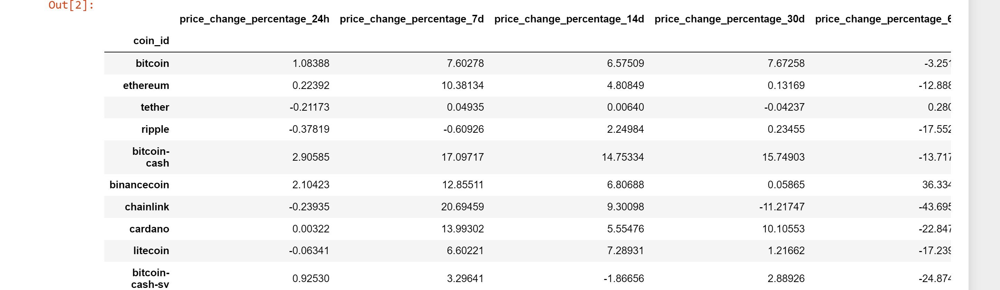

# CryptoClustering

Normalize the Data**:
    - Use `StandardScaler` from `scikit-learn` to normalize the data from the CSV file.
    - Create a DataFrame with the scaled data and set the "coin_id" index from the original DataFrame as the index for the new DataFrame
    

