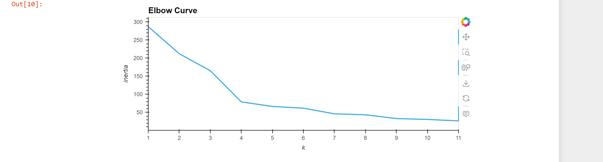
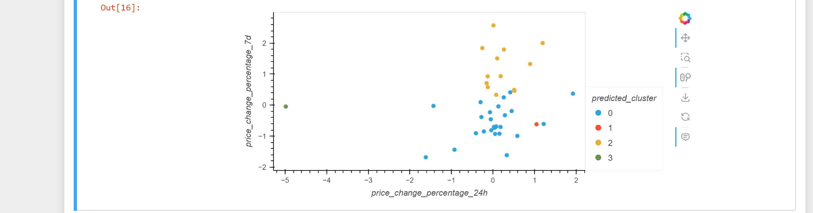
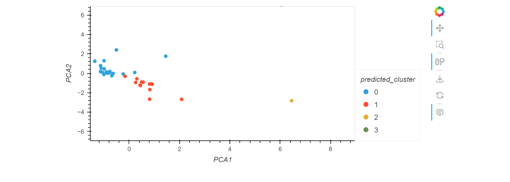

# CryptoClustering

Normalize the Data**:
    - Use `StandardScaler` from `scikit-learn` to normalize the data from the CSV file.
    - Create a DataFrame with the scaled data and set the "coin_id" index from the original DataFrame as the index for the new DataFrame
    

## Finding the Best Value for k

1. **Using the Original Scaled Data**:
    - Use the elbow method to find the best value for k:
      - Create a list with the number of k values from 1 to 11.
      - Compute the inertia for each k value and store it.
      - Plot a line chart to visually identify the optimal k value.
     

    

       ## Clustering Cryptocurrencies
         ### Original Scaled Data

1. **Cluster the Data**:
    - Initialize the K-means model with the best value for k.
    - Fit the model and predict clusters.
    - Added the predicted clusters to the original DataFrame.
  
 2. **Visualize**:
    - Create a scatter plot using `hvPlot`
      
  

### PCA Data

1. **Optimize Clusters**:
    - Perform PCA to reduce to three principal components.
    - Find the best k value using the elbow method on the PCA data.
    - Cluster the PCA data and visual
  
      ## Visualization

1. **Scatter Plot**:
    - Use `hvPlot` to create interactive scatter plots for both original scaled data and ## Visualization (continued)

### Elbow Method on PCA Data

1. **Elbow Method**:
    - Use the elbow method on the PCA data to find the best value for k:
  
    - ### Clustering with PCA Data

1. **Cluster and Visualize**:
    - Initialize the K-means model with the best value for k.
    - Fit the model using the PCA data and predict clusters.
    - Add the predicted clusters to the PCA DataFrame.

**Scatter Plot**:
    - Create a scatter plot using `hvPlot` for the PCA data:
     

     ## Acknowledgments

- **Xpert Learning Assistant**: Special thanks to Xpert Learning Assistant for the assistance provided during the project.
- **Course Examples**: References to examples and concepts learned during the class.

